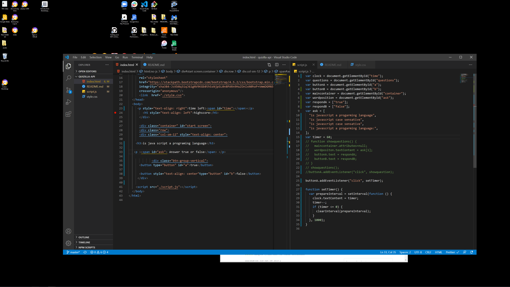

# quizilla-api

date:9/8/20

this is a anplication I was asked to create. Was told to make a quize game that asked questions about javascript using DOM manipulation.

The first step that I took was to creat a repository and added html file and a javascript file

Created elments like h1 and buttons and set them inside a container.
the reason to Create html elements is so they can be easy to manipulate by
using DOM method

My next step was to assigned variable the targeted the html properties.
The next step that I took was to create interval that subtracted one second at a time
for the game clock. if any wrong anwers is clicked the timer would be deducted by 20 seconds

I ended up creating a button with a eventlistener to start a timer.

What I wanted to do but, was not able to. is to change the questions being asked to clear() or null by adding a function to the container

eventually created a function that cycled a new positiong of the variable 'ask' array. to a diffrent positiong of the array
showing a new question and answers.


[this is the link to the page](https://wilmer88.github.io/quizilla-api/)


# 04 Web APIs: Code Quiz

As you proceed in your career as a web developer, you will probably be asked to complete a coding assessment, which is typically a combination of multiple-choice questions and interactive challenges. Build a timed code quiz with multiple-choice questions. This app will run in the browser and feature dynamically updated HTML and CSS powered by your JavaScript code. It will also feature a clean and polished user interface and be responsive, ensuring that it adapts to multiple screen sizes.

## User Story

```
AS A coding bootcamp student
I WANT to take a timed quiz on JavaScript fundamentals that stores high scores
SO THAT I can gauge my progress compared to my peers
```

## Acceptance Criteria

```
GIVEN I am taking a code quiz
WHEN I click the start button
THEN a timer starts and I am presented with a question
WHEN I answer a question
THEN I am presented with another question
WHEN I answer a question incorrectly
THEN time is subtracted from the clock
WHEN all questions are answered or the timer reaches 0
THEN the game is over
WHEN the game is over
THEN I can save my initials and score
```

The following animation demonstrates the application functionality:


### Review

You are required to submit the following for review:

* The URL of the functional, deployed application.

* The URL of the GitHub repository. Give the repository a unique name and include a README describing the project.

- - -
© 2019 Trilogy Education Services, a 2U, Inc. brand. All Rights Reserved.
