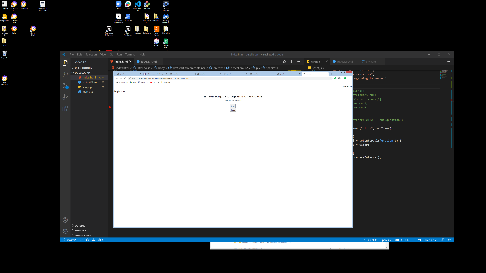

# quizilla-api

date:9/8/20

this is a anplication I was asked to create. Was told to make a quize game that asked questions about javascript using DOM manipulation.

The first step that I took was to creat a repository and added html file and a javascript file

Created elments like h1 and buttons and set them inside a container.
the reason to Create html elements is so they can be easy to manipulate by
using DOM method

My next step was to assigned variable the targeted the html properties.
The next step that I took was to create interval that subtracted one second at a time
for the game clock. if any wrong anwers is clicked the timer would be deducted by 20 seconds

I ended up creating a button with a eventlistener to start a timer.

What I wanted to do but, was not able to. is to change the questions being asked to clear() or null by adding a function to the container

eventually created a function that cycled a new positiong of the variable 'ask' array. to a diffrent positiong of the array
showing a new question and answers.

[this is the link to the page](https://wilmer88.github.io/quizilla-api/)
